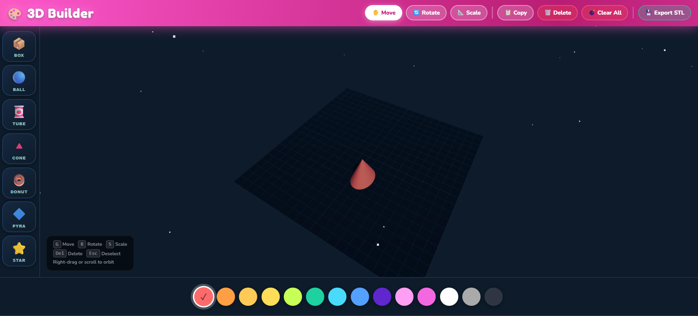

# 🎨 3D Builder for Kids

A fun, browser-based 3D modeling tool for kids — inspired by TinkerCAD. Drop shapes, paint them, move them around, and export your creation for 3D printing. No installation, no account, no internet connection required after first load.



---

## ✨ Features

- **7 built-in shapes** — Box, Ball, Tube, Cone, Donut, Pyramid, Star
- **Move, Rotate & Scale** with snapping (0.5 grid / 15° / 0.1 scale)
- **14-color palette** — instantly repaint any selected object
- **Duplicate & Delete** objects
- **Orbit camera** — right-drag to rotate, scroll to zoom
- **Export to STL** — ready for 3D printing in Cura, PrusaSlicer, Bambu Studio, etc.
- **Zero dependencies to install** — single HTML file, runs in any modern browser

---

## 🚀 Getting Started

Just open `3d-builder.html` in any modern browser (Chrome, Firefox, Edge, Safari).

```bash
# Clone the repo
git clone https://github.com/yourname/3d-builder.git

# Open in browser (no server needed)
open 3d-builder.html
```

Or host it anywhere static — GitHub Pages, Netlify, or even a USB stick.

---

## 🖱️ How to Use

### Adding Shapes
Click any shape button in the **left sidebar** to add it to the scene. It lands at a random spot on the grid, already selected and ready to move.

### Selecting Objects
Left-click any object in the 3D view to select it (highlighted in blue). Click empty space to deselect.

### Transforming Objects
Use the toolbar buttons or keyboard shortcuts:

| Action   | Button      | Shortcut |
|----------|-------------|----------|
| Move     | ✋ Move     | `G`      |
| Rotate   | 🔄 Rotate  | `R`      |
| Scale    | 📐 Scale   | `S`      |
| Delete   | 🗑️ Delete  | `Del`    |
| Deselect | —           | `Esc`    |
| Copy     | 📋 Copy    | `Ctrl+D` |

### Camera Controls
| Action | Input |
|--------|-------|
| Orbit  | Right-drag |
| Zoom   | Scroll wheel |
| Pan    | Middle-drag |

### Painting
Click any color swatch in the **bottom palette** to paint the selected object. Pick a color *before* adding a shape to start with that color.

### Exporting
Click **💾 Export STL** to download `3d-creation.stl` — a file containing all your shapes with positions, rotations, and scales baked in. Open it in any slicer to 3D print your creation.

---

## 🛠️ Tech Stack

| Library | Purpose |
|---------|---------|
| [Three.js r160](https://threejs.org) | 3D rendering |
| `OrbitControls` | Camera pan/zoom/orbit |
| `TransformControls` | Move/rotate/scale gizmos |
| `STLExporter` | Export geometry to STL |

All loaded from [esm.sh](https://esm.sh) CDN — no build step, no `npm install`.

---

## 📁 Project Structure

```
3d-builder.html   ← entire app, single file
README.md
```

That's it. Intentionally kept as a single self-contained file so it's trivial to share, host, or modify.

---

## 🗺️ Roadmap / Ideas

- [ ] Undo / redo (`Ctrl+Z`)
- [ ] Save & load scenes (JSON export/import)
- [ ] More shapes — arch, wedge, half-sphere, ring
- [ ] Snap-to-object alignment
- [ ] Boolean operations (union / subtract) — the hard part!
- [ ] Mobile / touch support
- [ ] Screenshot export (PNG)
- [ ] Dark / light theme toggle

PRs welcome!

---

## 📄 License

MIT — free to use, modify, and distribute.
